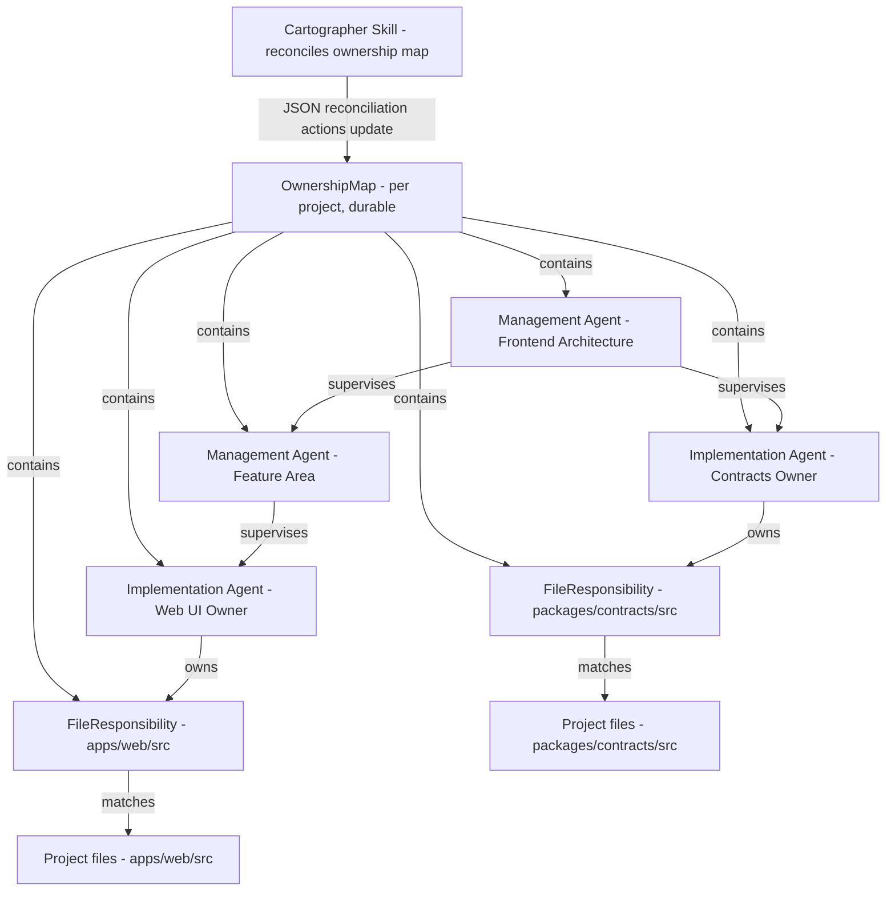
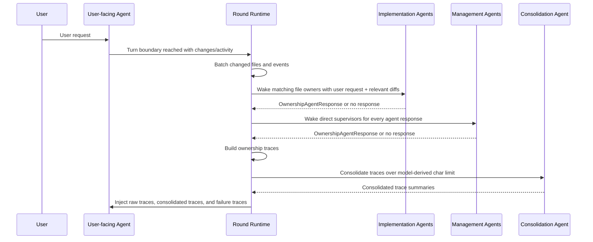
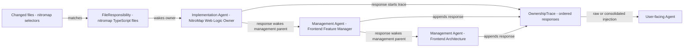
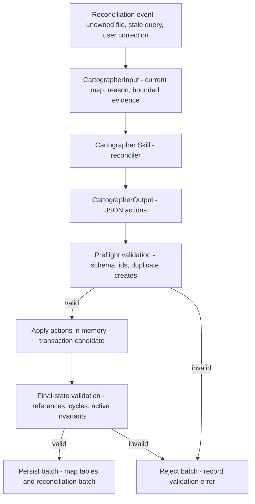

# NitroMap Ownership Map Vision

## Purpose

NitroCode currently presents coding-agent work as a chat application: projects contain threads, threads contain turns and messages, and the sidebar is the primary navigation model. This vision replaces that product shape with an ownership-oriented agent workspace.

Projects remain a first-class concept, but the main project surface becomes an ownership map rather than a list of chats. The map shows persistent agents, the scopes they care about, the relationships between those scopes, and the live interventions those agents make while work is happening.

The user can still start a conventional conversation, but a conversation is no longer the organizing center of the product. A conversation is a main-agent thread inside a project ownership map. The same conversation can launch many Nitro work episodes over time, and all conversations in the project share the same durable ownership map.

## Core Idea

Each project has an ownership map. The map describes which agents are responsible for which parts of the project, how those responsibilities relate to each other, and which agents should be consulted or allowed to intervene during work.

An agent owns responsibilities. Some responsibilities are abstract, while others resolve to concrete project resources.

A concrete responsibility is not just a label like "frontend files" or "build assets." It must carry a query that resolves the actual resources the responsibility covers. The query is part of the ownership definition, so the system can decide which agents care about a file, folder, diff, command, terminal event, or remote-resource update.

Concrete responsibilities can resolve resources such as:

- a folder
- a set of files
- a generated asset
- a remote resource

A worktree is not itself an owned artifact. It is an execution context where implementation agents can operate. An agent may own responsibilities whose resource queries are evaluated inside a worktree, but it should not own the whole worktree as its scope.

Responsibility queries should be typed rather than free-form prose. Early examples:

- path query: `apps/web/**`, `packages/contracts/src/orchestration.ts`
- file-set query: tracked files matching language, extension, or manifest ownership rules
- symbol query: exported functions, components, schemas, or generated API surfaces
- generated-artifact query: files derived from another source and the generator that produces them
- git query: files changed in a branch, pull request, checkpoint, or turn diff
- remote-resource query: repository issues, pull requests, CI jobs, deployments, docs pages, or external service objects
- event query: terminal commands, provider activity, build failures, approvals, or runtime errors relevant to the responsibility

The first implementation should only make file/path responsibilities executable. The broader query kinds above describe the direction, not the V1 runtime contract.

An agent can also own an abstract project concern, such as:

- build engineering
- release process
- testing strategy
- frontend architecture
- provider integration
- security posture
- observability

Ownership is therefore not limited to paths in a repository. It is a typed claim about responsibility.

## Responsibility Queries

Every non-abstract responsibility needs a resource query. The query is how the system answers the operational question: "does this event, resource, or proposed change touch this agent's scope?"

The query should be explicit enough to support automation, but expressive enough to cover more than path globs. A responsibility should have at least:

- a stable responsibility id
- an owning agent id
- a responsibility type
- a query type
- query parameters
- an evaluation context
- a human-readable rationale
- optional confidence and provenance

Example responsibility shapes:

```ts
type ConcreteResponsibility =
  | {
      type: "path";
      query: {
        root: "project" | "repository" | "workspace";
        include: string[];
        exclude?: string[];
      };
    }
  | {
      type: "symbol";
      query: {
        language: "typescript";
        exportedNames?: string[];
        sourceFiles: string[];
      };
    }
  | {
      type: "generatedArtifact";
      query: {
        outputs: string[];
        generatorCommand?: string;
        sourceInputs?: string[];
      };
    }
  | {
      type: "gitChange";
      query: {
        selector: "current-branch" | "pull-request" | "turn-diff" | "checkpoint";
        include?: string[];
        exclude?: string[];
      };
    }
  | {
      type: "remoteResource";
      query: {
        provider: "github" | "ci" | "deployment" | "docs" | string;
        resourceKind: string;
        selector: Record<string, unknown>;
      };
    }
  | {
      type: "runtimeEvent";
      query: {
        eventKinds: string[];
        match?: Record<string, unknown>;
      };
    };
```

This is a future expansion sketch, not the first runtime contract. The important requirement is that concrete ownership must be computable. The Cartographer can still explain a responsibility in natural language, but the system needs a query it can evaluate.

Queries should also be composable. A build engineer may have an abstract build responsibility plus several concrete responsibilities:

- path query for package manifests and build configs
- generated-artifact query for generated lockfiles or codegen outputs
- remote-resource query for CI workflows and failed build jobs
- runtime-event query for terminal commands that run build tooling

The map should retain the distinction between the broad management concern and each concrete query-backed resource scope.

## Cartographer

Every project has a special map-maintenance reconciler called the Cartographer. The Cartographer is responsible for creating, deleting, consolidating, and modifying ownership agents.

The Cartographer is implemented as a skill outside the ownership-agent graph. It is not persisted as an `OwnershipAgent`, does not participate in supervision edges, and does not have normal work-episode conversational state. Its job is not to perform normal implementation work directly. Its job is to maintain the project organization:

- discover existing project structure
- create initial ownership agents
- assign concrete query-backed responsibilities over files, folders, repositories, generated artifacts, events, or remote resources
- assign abstract scopes such as build, architecture, testing, release, or product concerns
- revise agent responsibilities as the project evolves
- split agents when one responsibility becomes too broad
- merge agents when responsibilities are redundant
- delete agents whose role no longer exists
- update ownership hierarchy when concrete and abstract scopes overlap

Ownership agents do not experience these changes as external edits to their personality. From an individual ownership agent's point of view, its current role is simply what it is. The Cartographer can modify an agent's core behavior and responsibility behind the scenes, and the agent should act according to the latest assigned scope.

The Cartographer should not be in the hot path for every normal work review. Its primary responsibility is maintaining the ownership graph and the routing rules that make agent activation predictable. Normal implementation and management agents participate in work rounds; the Cartographer wakes for map-maintenance events.

The Cartographer should operate as a reconciler skill:

```text
current ownership map + reconciliation reason + bounded evidence
  -> cartographer skill
  -> JSON actions
  -> runtime validation
  -> ownership map update
```

It should return structured map updates, not conversational advice. The application applies those updates only after validating that agent references, file matchers, and supervision edges remain coherent.

Cartographer wake events should be concrete and structured, for example:

- project initialized
- user requested ownership recomputation
- new package, directory, or important resource pattern detected
- changed files matched no implementation owner
- changed files matched too many owners
- an implementation agent reported that a change is outside its assigned scope
- a management agent reported repeated conflict between implementation agents
- a responsibility query became stale
- the user corrected an ownership assignment

This keeps the Cartographer reliable and auditable. It maintains the organization; it does not become an invisible extra reviewer for every file change.

The Cartographer skill's output should be JSON with a summary and a list of map reconciliation actions. Actions should cover real reconciliation operations:

- create, update, and delete agents
- create, update, and delete file responsibilities
- create, update, and delete supervision edges

The skill should not be artificially limited to soft deletes. If an agent, responsibility, or supervision edge is wrong, redundant, or no longer exists as a useful role, the Cartographer can delete it. The runtime should reject invalid resulting maps rather than asking the user to approve routine cleanup.

## Ownership Agents

Ownership agents persist as part of the project map. They are not just participants in a single chat thread.

An ownership agent represents responsibility for a domain. During a user-facing work episode, it can help in two ways:

1. It can be asked directly by the user-facing agent for context, warnings, decisions, or review.
2. It can observe relevant project activity and intervene when it believes the current work is violating or neglecting its responsibility.

This allows a user request to be interpreted from multiple angles. For example, a request that looks like a frontend change may also trigger a build engineer because package scripts changed, a testing owner because coverage should be adjusted, and an architecture owner because the change crosses module boundaries.

In the first implementation, ownership agents should focus on files and directories. Every implementation agent watches concrete resource queries. When a user-facing work round changes matching files, that implementation agent is woken with the batched diff and the relevant request context.

Implementation agents should receive at least:

- the original user request
- the user-facing agent's latest response or turn summary
- the relevant changed files and diff hunks
- the responsibility definitions that caused activation
- recent relevant interventions or unresolved findings

Implementation agents should not receive the entire project transcript by default. Their job is scoped review, warning, and context for the resources they own.

## Ownership Map Data Model

The ownership map should model agents first. Responsibilities and supervision edges attach behavior to agents.

```ts
type OwnershipMap = {
  projectId: string;
  version: number;
  updatedAt: string;

  agents: OwnershipAgent[];
  responsibilities: FileResponsibility[];
  supervision: SupervisionEdge[];
};
```

Agents are persistent project roles:

```ts
type OwnershipAgent = {
  id: string;

  /**
   * Implementation agents wake from file changes.
   * Management agents wake from responses produced by agents below them,
   * including implementation agents or other management agents.
   */
  type: "implementation" | "management";

  name: string;

  /**
   * Stable role description used to build the agent prompt.
   *
   * For management agents, this is also the V1 management responsibility
   * definition. The first implementation does not add a separate
   * ManagementResponsibility table/type; the Cartographer updates management
   * scope by updating this purpose and the supervision edges around the agent.
   */
  purpose: string;

  status: "active" | "stale" | "disabled";

  lastActivatedAt: string | null;
  lastResponseAt: string | null;

  createdAt: string;
  updatedAt: string;
};
```

File responsibilities are deterministic matchers. In the first implementation, only implementation agents can own them:

```ts
type FileResponsibility = {
  id: string;

  /**
   * Must point to an implementation agent.
   * Management agents do not directly own files.
   */
  agentId: string;

  type: "file-scope";
  status: "active" | "stale" | "disabled";

  title: string;

  /**
   * Evaluation root for globs. Runtime evaluates include/exclude relative to this.
   */
  root: {
    kind: "repository" | "workspace" | "project";
    path: string;
  };

  /**
   * Deterministic file matcher.
   * A changed file wakes this agent if it matches include and does not match exclude.
   */
  query: {
    include: string[];
    exclude: string[];
  };

  /**
   * Human/UI grouping only. Not used for matching.
   */
  display: {
    resourceLabel: string;
    category: "app" | "package" | "test" | "config" | "docs" | "build" | "generated" | "unknown";
  };

  /**
   * Why this responsibility exists.
   */
  rationale: string;

  /**
   * Operational meaning:
   * - 0.90-1.00: strong assignment; revisit only on contradiction or major structure change
   * - 0.70-0.89: normal assignment; acceptable but revisable when better evidence appears
   * - 0.40-0.69: tentative assignment; revisit when related files change again
   * - below 0.40: weak assignment; use only as temporary coverage for otherwise unowned files
   *
   * The runtime should not use confidence to decide whether a file matches.
   * Matching is only root + query. Confidence is for reconciliation priority,
   * UI explainability, and deciding what the Cartographer should revisit.
   */
  confidence: number;

  evidence: Array<{
    kind: "file" | "directory" | "user-instruction" | "agent-report" | "system-detection";
    value: string;
  }>;

  createdAt: string;
  updatedAt: string;
};
```

Supervision edges define the management hierarchy. A management agent can supervise any number of child agents, and each child can be either an implementation agent or another management agent:

```ts
type SupervisionEdge = {
  id: string;

  /**
   * Must point to a management agent.
   */
  supervisorAgentId: string;

  /**
   * Can point to either an implementation agent or another management agent.
   *
   * If the child emits a response during a round, this can wake the supervising
   * management agent in the next supervision layer.
   */
  childAgentId: string;

  status: "active" | "stale" | "disabled";

  /**
   * Why this supervisory relationship exists.
   */
  rationale: string;

  /**
   * Same operational meaning as responsibility confidence:
   * it tells the reconciler how stable this edge is.
   *
   * High confidence: keep unless contradicted.
   * Medium confidence: normal.
   * Low confidence: revisit when related agents respond or map is recomputed.
   *
   * It does not decide wake behavior. Active edge + child response decides wake behavior.
   */
  confidence: number;

  evidence: Array<{
    kind: "agent-purpose" | "user-instruction" | "agent-report" | "system-detection";
    value: string;
  }>;

  createdAt: string;
  updatedAt: string;
};
```

## Implementation Agents And Management Agents

The model has a hard split between implementation agents and management agents.

Implementation agents are bound to a workspace. A workspace can be a git repository, a worktree, or another concrete execution environment. Implementation agents own query-backed responsibilities evaluated in that workspace. During ownership rounds, their first job is scoped review and guidance over changed resources, not direct editing.

Management agents are abstract. They do not own files directly in the same way. Instead, they own a category of concern across any relevant workspace. A management agent may care about many files, many repositories, remote services, policies, or workflows, but its ownership is conceptual rather than workspace-bound.

The distinction is semantic, not merely visual:

- implementation agents are grounded in concrete mutable workspaces
- management agents are grounded in cross-cutting responsibility
- both can participate in a user-facing work episode
- both can appear in the ownership map
- only implementation agents own responsibilities over workspace-local implementation scope

Implementation agents wake from concrete resource changes. Management agents wake from responses produced by agents below them. A management agent can supervise multiple children, and each child can be an implementation agent or another management agent.

This creates a clear hierarchy:

- implementation agent: "a file or directory I own changed"
- management agent: "an agent under my concern responded"
- Cartographer: "the ownership graph itself may need to change"

Management agents should not depend on file resources directly in the first version. They sit above other agents and synthesize, escalate, or resolve cross-cutting concerns from the responses they supervise. For example, a frontend feature-area manager may wake after the web UI owner responds, and a frontend architecture manager may wake after that feature-area manager responds.

Management agents should receive:

- the original user request
- the user-facing agent's round summary
- the child-agent responses that caused activation
- compact changed-resource summaries when useful
- their management responsibility definition
- known conflicts, repeated concerns, or unresolved findings

Their job is synthesis and escalation, not line-by-line file review.

Wake behavior should follow the map data:

```text
file changed
  -> match active FileResponsibility
  -> wake owning implementation agent

agent produced a response
  -> find active SupervisionEdge where childAgentId is the responding agent
  -> wake supervisorAgentId
```

There is no separate "meaningful response" filter for management activation. If an agent decides to respond, its direct supervising management agents are woken. If an agent was woken but has nothing to contribute, it should produce no response event, and no management parent wakes from it.

The runtime should process management layers until no new supervising management agents wake, with cycle detection and a maximum depth.

## Work Rounds

The ownership system should be round-based. A user-facing conversation is not an unstructured stream where every agent can speak at any time. It advances through deterministic work rounds.

A Nitro round should look like this:

```text
user clicks Nitro submit for a project conversation
  -> user-facing agent acts
  -> user-facing agent reaches a turn boundary
  -> changed resources and events are collected
  -> relevant implementation agents are woken with batched diffs
  -> implementation responses are collected
  -> relevant management agents are woken from those responses
  -> management responses are collected
  -> a round packet is prepared for the user-facing agent
  -> the user-facing agent continues, fixes, asks, or finishes
```

Batching at the user-facing agent's turn boundary is important. It prevents piecemeal activation while files are still being edited and gives implementation agents a coherent diff to review.

The project conversation has two submit paths. The regular submit path, including pressing Enter, sends an ordinary message to the user-facing main agent and does not start a Nitro work episode or ownership round by itself. The regular path is available only when no Nitro episode is running for that conversation. While a Nitro episode is running, ordinary submit should be blocked; the user can inspect Work details or abort the running episode instead.

The Nitro submit path is an explicit user action that starts a new episode from the current prompt in the current conversation. That episode starts its first round and activates ownership-agent trace processing. The composer should show a project-map icon adjacent to the Nitro button so the action is visually tied to the project ownership map. If the Cartographer has not yet produced an ownership map for the project, the Nitro button must be disabled and its hover text should tell the user to run the Cartographer first.

Ownership-agent runtime state is episode-local. A Nitro episode creates fresh runtime context for the participating implementation and management agents. If the episode advances through multiple rounds, those agents keep the same episode runtime context across rounds so they can use what they learned earlier in the same episode. They are not reset between rounds.

Ownership-agent runtime state is reset between episodes. A later episode starts from the current durable ownership map and the current conversation prompt, not from hidden ownership-agent chat history left over from a prior episode. The only handover from one episode to later episodes is what the completed episode wrote into the main conversation thread as real messages, especially the final round result.

The user-facing agent, implementation agents, and management agents all need the user's request. Otherwise ownership agents lack the intent behind the changed resources. The amount of additional context should differ by role: implementation agents need relevant diffs; management agents usually need implementation responses plus summaries.

After the user starts a Nitro episode from the project conversation, the normal expectation is that the user does not need to manually coordinate the ownership agents. Ownership traces are inserted back into the main agent's context automatically, so the main agent can continue, fix, ask a focused follow-up, or finish with the specialist feedback already present. Intermediate round packets remain episode-local working context and Work-inspection state. The main conversation should receive only compact final round outputs as real `system` messages. Those messages should include deep links to the episode and round details. The detailed traces, invocation graph, concrete agent state, blockers, and abort status belong in the Work surface, not in the main chat transcript.

A Nitro episode continues while the ownership pass produces feedback that must be injected into the main agent context, comments the main agent should see, blockers, or follow-up work. The episode ends after the main agent has acted and the latest ownership-agent pass produces no injections, no comments, and no blockers. If all relevant ownership agents remain silent after the main agent's latest work, the episode is complete and its episode-local ownership-agent runtime state is discarded.

The user must still be able to abort an active conversation or work round. Abort means stopping the current user-facing agent turn and any pending ownership-agent phases that have not yet been injected. Already persisted messages, traces, and map state remain inspectable; aborting a conversation does not mutate the ownership map.

The Cartographer skill should receive a fixed reconciliation input:

```ts
type CartographerInput = {
  reason:
    | "unowned-file"
    | "overlapping-owners"
    | "implementation-without-manager"
    | "manager-without-children"
    | "agent-not-activated"
    | "responsibility-matches-no-files"
    | "new-resource-group"
    | "user-correction"
    | "recompute-requested";

  projectId: string;
  currentMap: OwnershipMap;

  evidence: {
    files?: Array<{
      path: string;
      exists: boolean;
      lastChangedAt?: string;
      changeCount?: number;
    }>;

    directories?: Array<{
      path: string;
      fileCount?: number;
    }>;

    agents?: Array<{
      agentId: string;
      note: string;
    }>;

    responsibilities?: Array<{
      responsibilityId: string;
      matchedFileCount?: number;
      note: string;
    }>;

    userInstruction?: string;
  };
};
```

The Cartographer skill should return only JSON matching this shape:

```ts
type CartographerOutput = {
  summary: string;
  actions: MapReconciliationAction[];
};

type MapReconciliationAction =
  | {
      type: "create-agent";
      agent: Omit<OwnershipAgent, "createdAt" | "updatedAt">;
    }
  | {
      type: "update-agent";
      agentId: string;
      patch: Partial<Pick<OwnershipAgent, "name" | "purpose" | "status">>;
      rationale: string;
    }
  | {
      type: "delete-agent";
      agentId: string;
      rationale: string;
    }
  | {
      type: "create-file-responsibility";
      responsibility: Omit<FileResponsibility, "createdAt" | "updatedAt">;
    }
  | {
      type: "update-file-responsibility";
      responsibilityId: string;
      patch: Partial<
        Pick<
          FileResponsibility,
          | "status"
          | "title"
          | "root"
          | "query"
          | "display"
          | "rationale"
          | "confidence"
          | "evidence"
        >
      >;
      rationale: string;
    }
  | {
      type: "delete-file-responsibility";
      responsibilityId: string;
      rationale: string;
    }
  | {
      type: "create-supervision-edge";
      edge: Omit<SupervisionEdge, "createdAt" | "updatedAt">;
    }
  | {
      type: "update-supervision-edge";
      edgeId: string;
      patch: Partial<Pick<SupervisionEdge, "status" | "rationale" | "confidence" | "evidence">>;
      rationale: string;
    }
  | {
      type: "delete-supervision-edge";
      edgeId: string;
      rationale: string;
    };
```

The runtime should validate Cartographer output before applying it:

- `FileResponsibility.agentId` must point to an implementation agent
- `SupervisionEdge.supervisorAgentId` must point to a management agent
- `SupervisionEdge.childAgentId` can point to an implementation or management agent
- active supervision edges must not form cycles
- no deleted agent can remain referenced by responsibilities or supervision edges
- active implementation agents should have at least one active file responsibility
- active management agents should have at least one active child edge, unless they are newly created in the same action batch
- `query.include` must not be empty
- `query.exclude` must exist, even if empty
- `confidence` must be between `0` and `1`
- file matching ignores `confidence`

Cartographer output should be applied as a transaction. Actions do not need to be valid one-by-one; the batch must be valid after all actions are applied to an in-memory copy of the current map.

```text
current map
  -> apply all proposed actions in memory
  -> validate the final map
  -> persist the whole batch if valid
  -> reject the whole batch if invalid
```

This allows normal cleanup operations such as deleting an old responsibility, deleting the supervision edge that referenced its agent, and deleting the now-unused agent in one reconciliation batch.

Validation should run in two stages:

- preflight validation: action type is known, referenced ids exist where required, created ids do not already exist, no duplicate creates exist in the same batch, and JSON matches the schema
- final-state validation: no dangling references remain, no active supervision cycles exist, active file responsibilities point to implementation agents, active supervision edges have management supervisors and existing children, active implementation agents have active responsibilities, active management agents have active child edges unless explicitly allowed as empty top-level managers, file includes are non-empty, excludes exist, and confidence values are between `0` and `1`

Each applied map reconciliation batch should be recorded for auditability and restart recovery:

```ts
type MapReconciliationBatch = {
  batchId: string;
  projectId: string;
  reason: CartographerInput["reason"];
  inputSummary: string;
  actions: MapReconciliationAction[];
  createdAt: string;
};
```

Normal ownership-agent outputs should also be structured. Free-form prose is useful for humans, but routing and follow-up behavior should depend on typed fields.

Implementation-agent and management-agent output should use the same response shape:

```ts
type OwnershipAgentResponse = {
  responseId: string;
  roundId: string;
  agentId: string;

  /**
   * Copied from the agent so traces can render and route without another lookup.
   */
  agentType: "implementation" | "management";

  /**
   * Short human-readable answer.
   */
  summary: string;

  /**
   * Structured issues or observations.
   */
  findings: Array<{
    severity: "info" | "warning" | "blocking";
    title: string;
    body: string;
    file?: string;
    line?: number;
  }>;

  /**
   * Concrete things the user-facing agent should consider doing.
   */
  recommendations: Array<{
    title: string;
    body: string;
    priority: "low" | "normal" | "high";
  }>;

  /**
   * Optional structured facts useful for later management agents.
   */
  signals: Array<{
    key: string;
    value: string;
  }>;

  createdAt: string;
};
```

Every implementation-agent response starts an ownership trace. Management-agent responses append to that trace as the response moves upward through supervision edges.

```ts
type OwnershipTrace = {
  traceId: string;
  roundId: string;

  rootAgentId: string;
  rootChangedFiles: string[];

  responses: OwnershipAgentResponse[];

  /**
   * Trace lifecycle for UI, restart recovery, aborts, and failure reporting.
   *
   * - pending: ownership or consolidation work is not finished yet
   * - injected: raw or consolidated trace was inserted into the main agent context
   * - failure-injected: a synthetic failure trace was inserted into the main agent context
   * - aborted: the user aborted before this trace was injected
   * - failed: trace production failed before a failure trace could be injected
   */
  status: "pending" | "injected" | "failure-injected" | "aborted" | "failed";

  injection:
    | { mode: "none" }
    | { mode: "raw"; injectedAt: string }
    | { mode: "consolidated"; consolidationId: string; injectedAt: string }
    | { mode: "failure"; failureTraceId: string; injectedAt: string };

  abortReason?: string;
  failureReason?: string;
};
```

A trace is the chain from an implementation response through any management responses above it:

```text
Web UI Owner
  -> Frontend Feature Manager
  -> Frontend Architecture Manager
```

All completed traces are eventually injected into the user-facing agent unless the user aborts the round first. If a trace is small enough, the raw trace can be inserted directly. If a trace is too large by character count, it should be consolidated by a separate consolidation agent with the user-facing agent's context, then the consolidated trace is injected.

Trace size should use a fixed character limit derived from the active model's context size. The limit should be deterministic for a given model/configuration so trace injection behavior is predictable.

The consolidation agent should not invent new findings. Its job is to compress, group, deduplicate, preserve attribution, and keep blocking findings and recommendations explicit.

If an ownership agent, management chain, or consolidation agent fails during a round, the system should inject a failure trace into the user-facing agent rather than retrying or blocking indefinitely. The failure trace should identify the failed agent or phase and enough context for the user-facing agent to continue honestly. If even failure-trace injection cannot be completed, the trace remains `failed` for UI inspection and restart recovery. A later version may expose a tool that lets the user-facing agent explicitly retrigger a failed trace.

After implementation and management phases complete, the system should build a round packet for the user-facing agent. The packet should not be a raw transcript dump. It should explain:

- what changed
- which ownership traces were produced
- blocking issues
- advisory notes
- required next actions
- which traces were injected raw
- which traces were consolidated
- which traces failed
- which traces were aborted

Large traces may be consolidated, but consolidation should preserve structured severity, ownership attribution, required actions, and unresolved conflicts.

The prepared round packet is injected into the user-facing agent during the active episode. Intermediate packets remain episode-local working context and Work-inspection state. When the episode completes, the final round result is materialized for the user as a compact `system` message in the main conversation. That message is the main transcript anchor for the episode result and should link to the episode and final round details. It should not inline the full trace graph or turn the main conversation into the place where episode internals are inspected.

## Ownership Hierarchy

Ownership can overlap, so the map needs hierarchy.

For example, a build engineer may be responsible for all build-related concerns across the project. Another implementation agent may own `package.json`, a Vite config file, or a CI workflow file. Both agents care about the same artifact, but at different levels:

- the implementation agent owns the concrete file or folder
- the build engineer owns the build concern expressed through that file

When scopes overlap, the map should make the relationship explicit through file responsibilities and supervision edges. A management agent can supervise another management agent, so hierarchy can represent layers such as implementation owner -> feature-area manager -> frontend architecture manager.

The product should avoid treating ownership as a flat list of path globs. The important object is a responsibility graph.

## User-Facing Work Episodes

The user still starts work by speaking to an agent. That user-facing agent behaves mostly like the existing harness expects: it can receive a request, use tools, ask questions, generate plans, and produce changes.

The difference is that the user-facing agent operates in the context of the ownership map. It is expected to know how to use the map:

- identify agents whose scope is relevant to the request
- ask those agents for context before acting
- route design questions to management agents
- route concrete implementation questions to implementation agents
- consider interventions from ownership agents during work
- explain conflicts or unresolved ownership disagreements to the user when needed

Each project conversation has its own user-facing main agent state. Different conversations in the same project share the same durable ownership map, but they are separate main-agent threads. Each conversation can launch many Nitro work episodes over time. Episodes have their own round state, trace state, result messages, and abort lifecycle. Ownership agents are activated from the shared project map, not from a conversation-specific copy of the map.

In many cases, the ownership agent should intervene before being asked. If it observes relevant files, diffs, terminal output, provider events, or remote-resource changes, it may decide that the active work episode needs guidance.

In the first implementation, these interventions happen at round boundaries after the user-facing agent has produced changes or activity. Later versions may support mid-turn interruption, but the initial product should keep ownership-agent activation deterministic and batched.

This should feel less like a one-on-one chat and more like working inside a living project organization where the right specialists notice when their domain is touched.

The active work episode should expose the round structure to the user. Users should be able to inspect why an agent woke, what resource or response triggered it, and what it contributed to the next main-agent context packet.

For example, a round could be shown as:

```text
Round 4
Main agent changed:
- apps/web/src/ChatView.tsx
- packages/contracts/src/orchestration.ts

Implementation reviews:
- Web UI Owner: warning
- Contracts Owner: blocking

Management reviews:
- Frontend Architecture: warning
- Reliability: info

Next action:
- Main agent must fix the contract compatibility issue.
```

This makes the application understandable as a project organization, not a many-agent chat room.

## Conversation And Reset Semantics

A new conversation creates fresh main-agent conversational state, but it does not reset the ownership map or mutate state for other active conversations or episodes.

The map is project memory. It persists until the user explicitly asks to recompute it from scratch or until the system applies a partial recomputation heuristic.

Conversations in the same project share the same ownership map and agent definitions, but they do not share the same main agent. Each conversation is a separate main-agent thread. A Nitro episode is a separate work object attached to one conversation, and the same conversation can have many episodes over time.

Expected reset behavior:

- starting a new conversation creates a clean main-agent thread
- starting a new conversation creates a separate user-facing main agent state for that conversation
- starting a Nitro episode creates fresh per-episode round, trace, and abort state attached to the current conversation
- ownership agents activated for the new episode receive fresh per-episode context
- ownership agents keep that per-episode runtime context across rounds inside the same episode
- ownership-agent runtime context is discarded when the episode ends
- a later episode can only inherit prior work through messages that were written into the main conversation thread, especially the completed episode's final round result
- agent definitions, scopes, hierarchy, and Cartographer-maintained organization persist
- ownership agents remain memory-light; do not add separate long-term per-agent memory beyond the durable ownership map in the first implementation
- the user can explicitly request a full ownership-map recompute
- the system may perform partial recomputation when project structure changes enough to justify it

The distinction matters because the ownership map represents project organization, not chat history.

## Map Evolution

The ownership map should evolve over time.

Initial ownership can be derived from repository structure, package boundaries, file types, naming conventions, existing docs, tests, CI, and recent user activity. That initial map will be imperfect. The Cartographer should refine it as evidence accumulates.

Map evolution can be triggered by:

- major file or folder changes
- new packages, apps, or services
- repeated ownership conflicts
- repeated interventions from the same agent
- stale scopes with no matching artifacts
- new remote resources
- user corrections
- scheduled Cartographer audit
- explicit recompute commands

The system should prefer stable, predictable ownership over excessive churn. A map that changes constantly will be hard for users and agents to trust.

## Product Shape

The primary UI should stop being a chat sidebar plus message timeline.

The new first-order surfaces are:

- project list or project switcher
- ownership map
- active work episode
- map recomputation and reconciliation actions

The ownership map should be the main navigation and orientation surface inside a project. It should show agents, responsibilities, hierarchy, and active status. The user should be able to inspect an agent to understand what it owns, why it exists, when it last intervened, and what evidence supports its scope.

The active work episode can link back to the conversation that launched it, but it should not dominate the product. Work should be organized as episodes and rounds. Regular conversation messages remain available for iteration with the main agent when no Nitro episode is running, and they do not create episodes. The Nitro submit action starts a new episode from the current conversation prompt only after the project has an ownership map. Each round shows the concrete ownership-agent invocations that happened before the trace packet was injected back into the user-facing main agent context. The final round result is written back into the main thread as a compact `system` result message.

## UI Concept Direction

NitroMap should feel like an operational project map, not a chat product with extra panels.

The default project screen should make the ownership map the dominant surface. A compact left navigation can switch between projects, Map, Work, and Map Maintenance, but the center of gravity is the map canvas. The user should arrive in a project and immediately see the important owned resources, which agents own them, where responsibility overlaps, and what work is active.

The map canvas should render resources as legible visual nodes rather than as a plain filesystem tree. Useful node categories include:

- folders and package areas
- file groups selected by responsibility queries
- generated artifacts
- tests
- CI pipelines
- pull requests
- docs
- deployments
- databases and remote services

Implementation-agent ownership should be shown adjacent to the resources it applies to. Management agents should appear through supervision relationships above implementation agents, and may be drawn near the resource groups owned by their descendants. These repeated visual instances should resolve back to one canonical agent profile, so the map stays local and readable without duplicating the underlying agent.

The UI should support at least three inspection paths:

- resource inspection: what this node represents, which queries selected it, who owns it, and what changed recently
- agent inspection: role, type, responsibilities, matched resources, recent interventions, and Cartographer rationale
- ownership-change inspection: what the Cartographer changed, from whom, to whom, why, and when

The active work episode should be compact but explicit about rounds. It should show the current request, round status, involved concrete agent invocations, interventions, changed resources, approvals, and final outcome. It should not render a long chat transcript by default. NitroMap assumes users inspect details through the editor, diffs, resource panels, terminals, round trace graphs, and map nodes when they need precision.

The Work surface should not be a generic activity stream. Activity that matters to the user should be attached to a work episode, a round, a trace, a concrete invocation, a blocker, or a map reconciliation action. A round trace graph should flow left to right from the first concrete agent invocation through any implementation and management agents it woke. This preserves causality and branching better than a flat line while still being scoped to one round.

Conversation history still exists, but it is not primary navigation. A project can have many conversations, and all conversations share the same ownership map and agent assignment. A conversation is a normal main-agent thread that can produce many work episodes over the project organization; it is not an isolated chat room with its own agent universe.

The Cartographer needs a separate, explicit surface. This should be exposed to users as Map Maintenance: a dedicated panel, tab, or chat-like control area attached to the map. Its purpose is map maintenance:

- recompute ownership
- explain why an agent owns a resource
- change responsibility queries
- split or merge agents
- inspect or revert Cartographer-applied ownership changes
- inspect recomputation history

Map reconciliation actions should be visible as map diffs rather than buried in prose. The user should be able to see agents added, agents removed, responsibilities changed, query matches changed, and hierarchy changes.

Interventions should appear in the active work panel and, when spatially meaningful, the map. A warning from a build engineer should visually connect to the affected build resources. A test-owner intervention should connect to the relevant test nodes. This makes agent feedback spatially grounded and prevents a separate activity stream from becoming another chat log.

The map should prioritize usability across several dimensions:

- orientation: the user can quickly understand project structure and responsibility boundaries
- locality: resource nodes show nearby owners without requiring global lookup
- hierarchy: abstract and concrete ownership relationships are visible without flattening everything into path globs
- actionability: active work, interventions, and changed resources are one click away from details
- compactness: chat history is summarized and does not consume the main interface
- explainability: every ownership assignment can be traced to a query, rationale, map reconciliation action, or recomputation result
- stability: the map should not rearrange unpredictably while work is in progress
- performance: large histories and verbose transcripts should stay out of the hot rendering path
- debuggability: ownership conflicts, stale assignments, and low-confidence scopes should be inspectable
- recoverability: recompute actions and Cartographer edits should have visible history and reversibility

## Relationship To Current Architecture

The current architecture already has useful primitives:

- projects
- threads
- provider sessions
- provider runtime events
- server-side orchestration events
- durable projections
- websocket push updates
- checkpoint and diff summaries
- runtime receipts for async completion

The ownership-map system can build on these concepts, but it likely needs new domain objects. Threads are not enough. A thread currently represents the primary user-facing work container. In the ownership model, the durable project-level graph is primary, conversations are main-agent threads attached to that graph, and work episodes are separate objects launched from those conversations.

The ownership map should be stored per project and survive application restarts. It should be server-owned durable state, not frontend-only state. The frontend can render and inspect the map, but Cartographer JSON should be applied and validated on the server before persistence.

Minimum durable storage should support:

- ownership agents
- file responsibilities
- supervision edges
- map reconciliation batches
- ownership agent responses
- ownership traces
- trace consolidations

The map tables can be projected into the `OwnershipMap` read model used by the UI and runtime wake logic. Responses, traces, and consolidations belong to work episodes rather than to the persistent map itself, but they should still be durable enough to survive restarts, support UI inspection, and avoid losing ownership feedback while the user-facing agent is waiting for a round packet.

Expected durable domain objects:

- ownership map
- ownership agent
- file responsibility
- supervision edge
- map reconciliation batch
- ownership agent response
- ownership trace
- trace consolidation
- work episode
- map recomputation job

Do not add a separate long-term per-agent memory store in the first implementation. If the runtime needs restart recovery for an in-flight round, persist bounded work-episode context such as responses, traces, consolidations, and round packets rather than durable personal memory for each ownership agent.

The current event-sourced orchestration style is a strong fit for this model because ownership changes, interventions, and work-episode activity all need to be observable, replayable, and projectable into UI state.

## Architecture Diagrams

Diagrams in this document should use one viewpoint at a time and define what their arrows mean. The goal is not decoration; the goal is to make ownership, wake behavior, traces, and persistence visually inspectable without mixing incompatible relationships.

### Ownership Map Structure

Viewpoint: durable per-project ownership map.

Arrow meaning:

- `supervises`: parent management agent wakes when the child agent responds
- `owns`: implementation agent wakes when changed files match the file responsibility
- `matches`: file responsibility evaluates its glob query against project files



### Work Round Execution

Viewpoint: one user-facing work round.

Arrow meaning:

- each arrow means "happens after and passes the relevant structured context"
- this diagram is temporal, not ownership hierarchy



### Trace Propagation

Viewpoint: a single trace created by one implementation-agent response.

Arrow meaning:

- `response wakes management parent`: the child agent produced a response, so every active direct supervision edge wakes
- `appends response`: the management response becomes the next entry in the same trace



### Cartographer Reconciliation

Viewpoint: ownership-map maintenance.

Arrow meaning:

- each arrow means "passes data to the next reconciliation step"
- this diagram is about map updates, not normal work-round review



## Design Principle

The goal is not to decorate a chat app with agent labels. The goal is to make project responsibility the central interface.

The user should feel that the project has an adaptive organization around it. Agents are not merely personas in a sidebar. They are persistent owners of project responsibilities, coordinated by the Cartographer, surfaced through a map, and involved in work because the scope of the work touches what they own.
